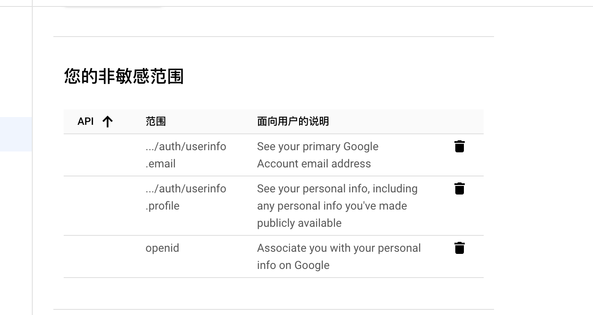
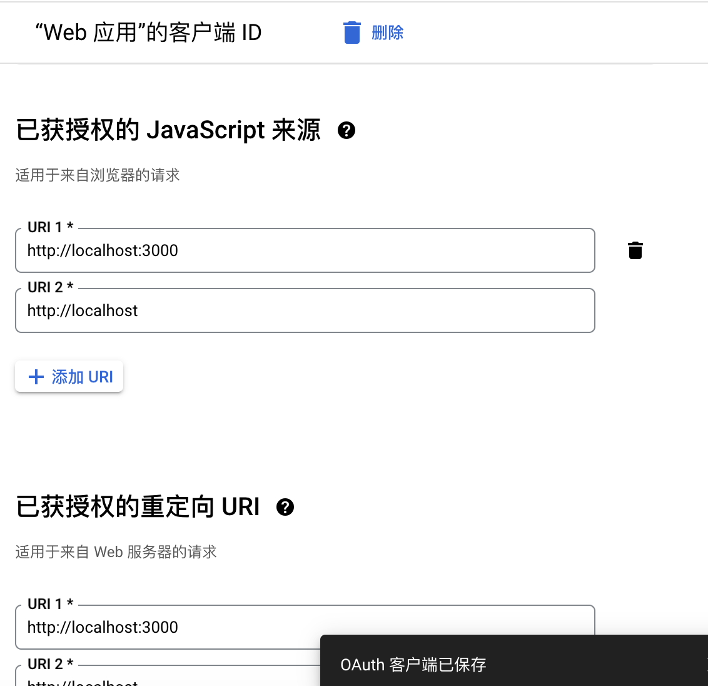

# Google Login oAuth

## Google Cloud Config

- [x] oAuth Screen(https://console.cloud.google.com/apis/credentials/consent?project=disco-dispatch-421213) or watch the video https://www.youtube.com/watch?v=HtJKUQXmtok&t=11s
*** The most important thing is to select this information *** 

- [x] Create oAuth Client ID
*** Authorized JavaScript sources ***
You also need to fill in this address http://localhost

https://developers.google.com/identity/oauth2/web/guides/get-google-api-clientid?hl=zh-cn

## Component

- [X] [react-oauth](https://github.com/MomenSherif/react-oauth?tab=readme-ov-file)
- [ ] react-google-login(not suport)
